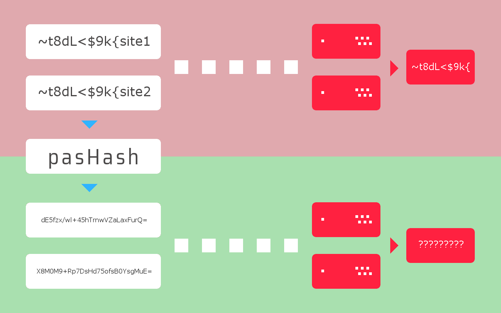

# pasHash - deterministic password generator
Transform your password into a RIPEMD-160 hash on the client side.
--------------------------------------------------------------------------------------------------------------------------------------

<b>pasHash</b> is a small javascript that allows you to hide your password from an aggressive environment.
By transforming him into a RIPEMD-160 hash on the client side.
For example, you use 'qwerty' as password on several sites, simply changing the ending.

- qwerty1 - For site #1
- qwerty2 - For site #2

Agree, if at least on one service the passwords are stored in plain-text and the company has become a victim of data leakage...
Then your password becomes another item in bruteforce list.
By the way, let's check these passwords at <a href="https://haveibeenpwned.com/Passwords">https://haveibeenpwned.com/Passwords</a>

- qwerty1 ~578 162 times
- qwerty2 ~27 224 times

Even if you memorize something like ~t8dL<$9k{ and use it by adding different endings:

- ~t8dL<$9k{google
- ~t8dL<$9k{facebook

However, there no guarantee that somewhere the password will not be stored in plain-text.
With pasHash you turn a password into a unique string:
- FTBpRPfRTWdMhj0xvKzVaZk1W6Q= : BASE64(RIPEMD160( ~t8dL<$9k{google ))
- X8M0M9+Rp7DsHd75ofsB0YsgMuE= : BASE64(RIPEMD160( ~t8dL<$9k{facebook ))

Now, even if the bad guys can access to the databases, then they will not be able to apply this knowledge to other sites. 
And you can store in memory only the basis of the password - ~t8dL<$9k 
Password managers are no longer needed :) 
10-12 arbitrary characters are able to remember >99 percent of people. 
Please use a really strong foundation for your password that cannot be picked up by brute force. 

# Possible problems:

According <a href="https://crackstation.net/hashing-security.htm">https://crackstation.net/hashing-security.htm</a>

1) Double hashing
2) This code has not been verified by crypto professionals. See <a href="https://www.reddit.com/r/crypto/comments/a8casj/lets_use_hashes_of_passwords_instead_of_passwords/">this discussion</a>.
3) Using simple 'salt' is not safe.

# How to install it?

1) From Chrome Web Store. Coming soon.
2) Download archive with pasHash and run popup.html on your device.
3) Try <a href="https://0x1235.github.io/pasHash/extension/popup.html">live demo</a>
